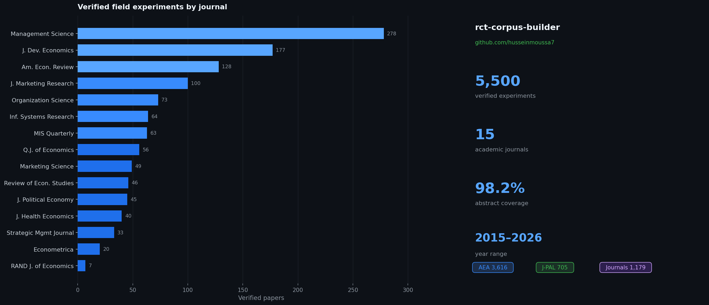

# rct-corpus-builder

An automated pipeline that collects, deduplicates, labels, and classifies academic field experiment papers from four data sources into a single curated dataset. The output is a clean, deduplicated corpus of **5,500 verified field experiments and RCTs** drawn from 15 top journals plus the AEA RCT Registry and J-PAL.



## Dataset at a glance

| | |
|---|---|
| **Verified papers** | 5,500 |
| **Year range** | 2015–2026 |
| **Abstract coverage** | 98.2% (5,403 / 5,500) |
| **Sources** | OpenAlex (15 journals) · AEA RCT Registry · J-PAL |
| **Main output** | `data_collection/papers/verified_papers.csv` (6.5 MB) |

### Journals covered

| Field | Journals |
|-------|---------|
| Economics | AER · QJE · JPE · RAND · RES · Econometrica |
| Development | Journal of Development Economics · Journal of Health Economics |
| Management | Management Science · Organization Science · SMJ |
| Marketing / IS | Marketing Science · JMR · ISR · MISQ |

---

## Pipeline architecture

```
┌─────────────────────────────────────────────────────────────────┐
│  Step 1 — Collect                                               │
│   ├── OpenAlex API     15 journals × 4 search terms  →  2,857   │
│   ├── AEA RCT Registry all completed trials          →  3,616   │
│   └── J-PAL sitemap    all evaluations               →    705   │
│                                          Total raw   →  7,178   │
├─────────────────────────────────────────────────────────────────┤
│  Step 2 — Deduplicate & merge  →  all_papers.csv                │
│   Primary key: normalized DOI                                   │
│   Fallback:    normalized title + year                          │
├─────────────────────────────────────────────────────────────────┤
│  Step 3 — Cross-reference registries                            │
│   in_aea  = True if source is AEA or DOI matches AEA record     │
│   in_jpal = True if source is J-PAL or DOI matches J-PAL        │
│                               Registry-confirmed  →  4,321      │
├─────────────────────────────────────────────────────────────────┤
│  Step 4 — Abstract recovery  (2,857 OpenAlex papers)            │
│   Semantic Scholar batch API  →  +150 abstracts                 │
│   Remaining missing: 59 Elsevier papers (require inst. IP)      │
├─────────────────────────────────────────────────────────────────┤
│  Step 5 — Keyword filter  (2,857 OpenAlex papers)               │
│   kw_strong: 866   "randomized trial", "field experiment" …     │
│   kw_weak:   407   "experiment", "intervention" …               │
│   kw_none: 1,584   no experiment language in title/abstract     │
├─────────────────────────────────────────────────────────────────┤
│  Step 6 — LLM classification  (GPT-4o-mini, all 2,857)          │
│   llm_yes: 1,179   llm_no: 1,678                                │
├─────────────────────────────────────────────────────────────────┤
│  Step 7 — Manual review                                         │
│   7 borderline cases resolved; 9 low-confidence papers dropped  │
├─────────────────────────────────────────────────────────────────┤
│  Output — verified_papers.csv                                   │
│   Registry-confirmed: 4,321  +  LLM-confirmed: 1,179            │
│                               Total verified  →  5,500          │
└─────────────────────────────────────────────────────────────────┘
```

---

## Quickstart

### 1. Clone and install

```bash
git clone https://github.com/husseinmoussa7/rct-corpus-builder.git
cd rct-corpus-builder
python -m venv .venv && source .venv/bin/activate
pip install -r requirements.txt
```

### 2. Configure

```bash
cp .env.example .env
# Edit .env — at minimum set OPENALEX_EMAIL and OPENAI_API_KEY
```

### 3. Run the full pipeline

```bash
python data_collection/collect.py
```

The pipeline is **fully resumable** — every API response is cached to `data_collection/papers/raw/`. Re-running skips already-fetched pages and only retrieves new content.

### 4. Use the dataset directly

The output CSVs are included in this repo. Skip the collection step and load them directly:

```python
import pandas as pd

# 5,500 verified field experiments
df = pd.read_csv("data_collection/papers/verified_papers.csv")

# Filter to registry-confirmed only (highest confidence)
registry = df[df["rct_confirmed"] == True]   # 4,321 papers

# Filter to LLM-confirmed journal papers
journal  = df[df["has_rct_abstract"] == "llm_yes"]  # 1,179 papers

# Search by topic
marketing = df[df["journal"].isin(["MGTSCI", "JMR", "MKTSCI", "ISR", "MISQ"])]
```

---

## Output schema

`verified_papers.csv` and `all_papers.csv` share this column schema:

| Column | Description |
|--------|-------------|
| `paper_id` | Unique ID (prefix: `OA_`, `AEA_`, `JPAL_`) |
| `doi` | Normalized DOI |
| `title` | Paper title |
| `authors_str` | Semicolon-separated author names |
| `year` | Publication / registration year |
| `journal` | Journal abbreviation (OpenAlex papers only) |
| `source` | `openalex` / `aea_registry` / `jpal` |
| `abstract` | Full abstract text (98.2% coverage) |
| `url` | Landing page URL |
| `pdf_url` | Open-access PDF URL (OpenAlex only) |
| `rct_registry_id` | AEA registry ID (e.g. `AEARCTR-0001234`) |
| `jpal_id` | J-PAL evaluation ID |
| `citation_count` | Citation count from OpenAlex |
| `date_collected` | ISO date of collection |
| `in_aea` | `True` if confirmed in AEA registry |
| `in_jpal` | `True` if confirmed in J-PAL |
| `rct_confirmed` | `True` if confirmed in either registry |
| `kw_label` | `kw_strong` / `kw_weak` / `kw_none` (OpenAlex only) |
| `has_rct_abstract` | `llm_yes` / `llm_no` (OpenAlex only) |
| `rct_confidence` | GPT-4o-mini confidence score (0–1) |
| `rct_reason` | One-sentence LLM rationale |

---

## Repository structure

```
data_collection/
├── collect.py          # Main pipeline entry point — runs all steps end-to-end
├── config.py           # Paths, journal ISSNs, search terms, rate limits
├── schema.py           # PaperRecord dataclass (single canonical schema)
├── storage.py          # CSV read/write and raw cache helpers
├── label.py            # Keyword filter + GPT-4o-mini classification
└── collectors/
    ├── openalex.py     # OpenAlex API collector (15 journals)
    ├── aea_rct.py      # AEA RCT Registry scraper
    ├── jpal.py         # J-PAL sitemap scraper
    └── bit.py          # BIT (stub — no structured listing available)

data_collection/papers/
├── all_papers.csv       # 7,178 rows — all collected records with labels
├── verified_papers.csv  # 5,500 rows — main output (registry + LLM confirmed)
└── needs_review.csv     # 0 rows — all borderline cases resolved

docs/
└── PIPELINE_SUMMARY.md  # Full pipeline documentation with counts
```

---

## Extending the pipeline

### Add a new journal (OpenAlex)

Add an entry to `JOURNAL_ISSNS` in `data_collection/config.py`:

```python
JOURNAL_ISSNS["JMKT"] = "0022-2429"  # Journal of Marketing
```

Re-run `collect.py` — only new journal pages will be fetched (cached results are reused).

### Add a new data source

Implement a new collector in `data_collection/collectors/` following the interface in `openalex.py`:

```python
def fetch_all(manifest: set[str]) -> list[PaperRecord]:
    ...
```

Then call it from `data_collection/collect.py`.

### Change the search terms

Edit `FIELD_EXPERIMENT_SEARCHES` in `data_collection/config.py`. Delete the relevant cache files in `data_collection/papers/raw/openalex/` to force a re-fetch.

### Recover missing abstracts (Elsevier)

59 JDE/JHE papers are missing abstracts because Elsevier blocks non-institutional IPs. Run `collect.py` from a university VPN or on-campus network with `ELSEVIER_API_KEY` set in `.env`.

---

## Requirements

- Python 3.12+
- See `requirements.txt` for dependencies
- OpenAI API key (for Step 6 LLM classification — ~$0.23 for a full run on 2,857 papers)
- Registered email for OpenAlex polite pool (any email, set as `OPENALEX_EMAIL` in `.env`)

---

## Citation

If you use this dataset or pipeline in your research, please cite:

```bibtex
@misc{rct-corpus-builder,
  title  = {rct-corpus-builder: An Automated Pipeline for Field Experiment Paper Collection},
  year   = {2026},
  url    = {https://github.com/husseinmoussa7/rct-corpus-builder}
}
```

---

## License

MIT License — see [LICENSE](LICENSE).
